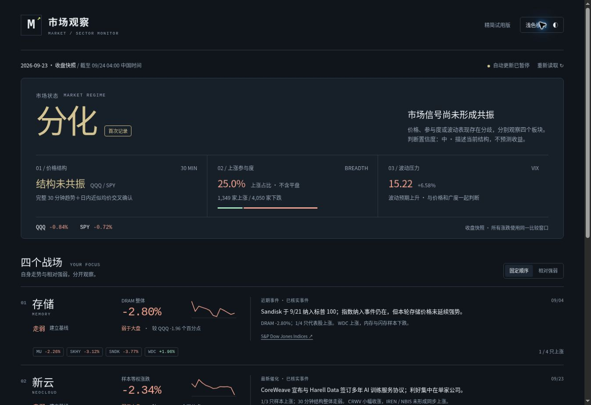

# v18 试用版验收

- 应用提交：48b8392e2b4cf487868244a3e3d16a6424ff9a1e。
- GitHub Actions：Validate compact dashboard 与 Pages build and deployment 均 success。
- 13项JavaScript回归、5项Python源数据重放测试通过。
- 线上data.json与本地SHA256一致：1304ab91279b9835b5a056dcc5f8e693df34a0a2c29da7ed3fc15c7ef5b361bc。
- 桌面1363px、iframe390px/360px均无横向溢出；窄屏实际内容宽度为375px/345px（扣除滚动条）。
- 板块相对排序、恢复固定顺序、明暗切换、重新读取快照功能通过。
- 页面脚本未发现运行错误；浏览器扩展自身metadata警告不来自网站代码。
- 旧版data归档与迁移前SHA256一致，原有历史未删改。
- 本轮行情是2026-09-23美股收盘；不是盘前实时行情。首次记录不虚构较上次变化。
- 精简流程已更新到原四个任务；原09:05/11:05/14:05/16:25 ET日程未修改，当前仍暂停。
- 阻塞：任务工具不提供模型字段，网页设置入口需要登录。未核实GPT-5.6 SOL或Luna前不得启用。提示词不代表实际模型已改变。

