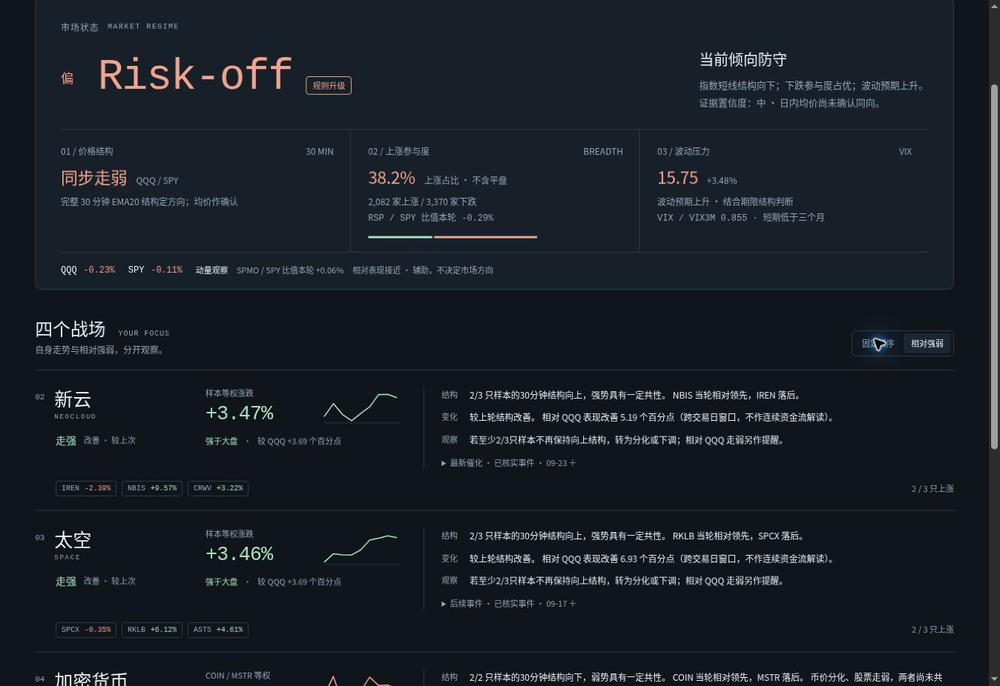

# v18.2 验收

- 发布版本：46268bcda43560c3ecc719ccf2b3aebb2a0bff86。
- 23 项 JavaScript 与 5 项 Python 检查通过；数据、交易时段校验通过。
- 线上 data.json 与本地发布数据 SHA-256 一致。
- GitHub 数据校验及 Pages 发布成功。
- 桌面宽度 1348、手机预览宽度 390 / 360 均无横向溢出（手机内容宽度扣除滚动条后为 375 / 345）。
- 新闻折叠与相对强弱排序正常；页面展示新增指标和四板块结构、变化、观察条件。
- 三个新增指标与原有行情对齐至同一完成的 30 分钟时点；未刷新原有新闻或改变交易时段。
- 未修改自动任务状态。验收时盘前、午后、收盘任务启用，盘中任务暂停。

