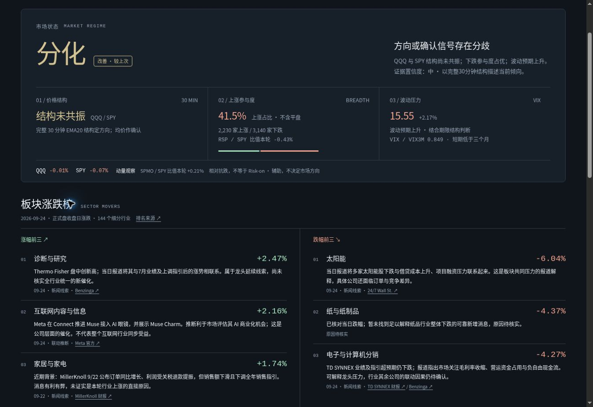

# v18.3 验收

- 发布提交：ef3ce71f148c65bad747bbc54628e18c12d3b567；GitHub 校验及 Pages 部署成功。
- 28项 JavaScript + 10项 Python 测试通过；线上 data.json 与本地 SHA-256 一致，结构与时段检查通过。
- 榜单基于144个Finviz细分行业，日累计涨跌各前三；5项有新闻来源、1项原因待核实。
- 桌面1348宽、手机390/360预览无横向溢出；新闻直接展示。手机内容宽度扣除滚动条后为375/345。
- 四个原定时任务均保留启用状态，提示词升级为v18.3，纳入榜单及6条增量新闻复核；原日程和模型要求保留。

