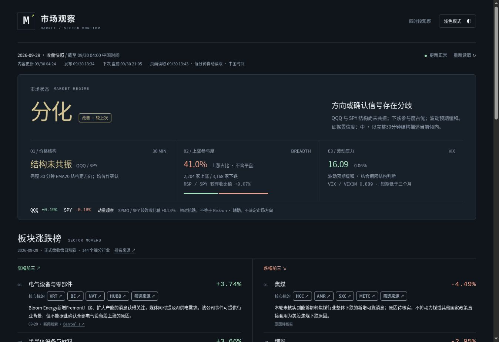

# v18.7 验收

- 页面实现提交：f11e7222af24d43a9805cc16127158482bfef570；GitHub 数据校验和 Pages 部署均成功。
- 40 项 JavaScript 与 27 项 Python 测试通过，包括两阶段发布、新闻超时、冲突保护、缓存复用和线上内容核验。
- 已修复盘中到收盘的比较：规则版本不变时正常比较；市场显示改善，存储显示改善，云板块保留结构偏弱及当日累计涨幅。
- 页面新增实际行情、内容更新、发布时间、下一时段及页面读取时间；可见页面每分钟自动读取，休市等待不误报逾期。
- 统一任务入口先发布行情、再补充新闻；交易日核心标的缓存和重复来源合并已接入四个任务。
- 四个原任务仍启用；纽约时间 09:05、11:05、14:05、16:25 不变。提示词一致性已逐项确认。
- 线上 data.json 与提交中的发布文件逐字节一致，22 项资产及更新元数据核验通过。此次未重新抓取历史行情。
- legacy/data.json 保持原 SHA d180d571bd20c04f43d6a1dd68d3c5810a01fbdd。

